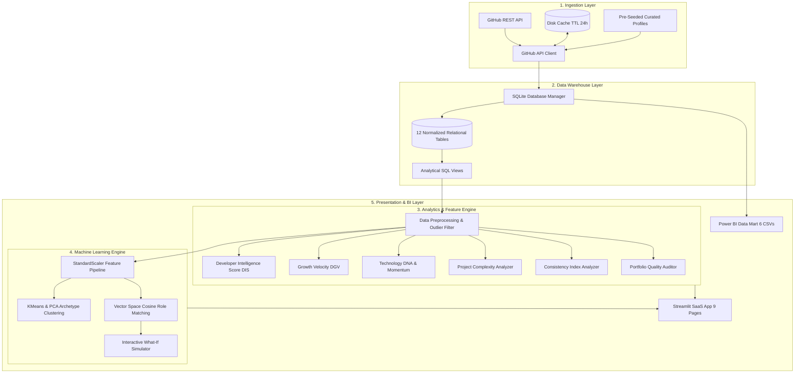
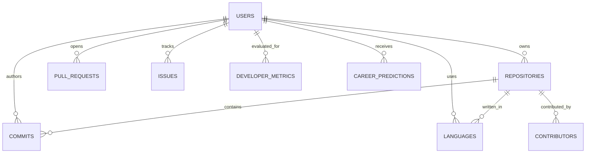

# Developer Career Intelligence & Analytics Platform

<p align="center">
  <strong>An enterprise-grade analytical platform that transforms raw GitHub activity, repositories, commits, and language telemetries into a multi-dimensional Developer Intelligence Profile.</strong>
</p>

<p align="center">
  
  
  
  
  
  
  
  
</p>

<p align="center">
  <a href="https://vercel.com/new/clone?repository-url=https%3A%2F%2Fgithub.com%2Fshrutirai29%2FCodeDNA">
    
  </a>
</p>

---

## 📌 Executive Summary

Traditional GitHub dashboards merely report vanity counts: number of commits, total stars, or top lifetime languages. **Developer Career Intelligence & Analytics Platform** bridges the gap between raw version control data and meaningful engineering career intelligence.

By synthesizing **Data Engineering**, **Exploratory Data Analysis**, **Statistical Profiling**, **Unsupervised Machine Learning**, and **Vector Space Modeling**, this platform evaluates:
- What technologies a developer actually uses and pushes in production vs. experiments.
- How consistent their development cadence is (penalizing bursty commit spam).
- Where they sit in the **Developer Archetype Space** using KMeans and PCA.
- How closely their demonstrated skill footprint aligns with 8 industry career paths.
- What happens to their role readiness if they learn targeted skills (Interactive What-If Simulation).

---

## 🏗️ End-to-End System Architecture



---

## 🗄️ Relational Database Schema (Data Warehouse)

The platform operates on a normalized 12-table SQLite relational database (`data/developer_intelligence.db`) with indexes and analytical views:



### Table Definitions
1. `users`: GitHub user profile, follower/following count, metadata, bio.
2. `repositories`: Codebase size, stargazers, forks, licenses, topics, CI/CD and Docker flags, complexity score.
3. `languages`: Repository-level language byte volume and usage share.
4. `commits`: Commit timestamps, weekday, hour, additions, deletions, code changes.
5. `pull_requests`: PR state, merged status, review timelines.
6. `issues`: Issue tracking, closure timestamps.
7. `contributors`: Multi-author collaboration and external contribution ratios.
8. `organizations`: Organization affiliations.
9. `developer_metrics`: Computed composite scores (Depth, Breadth, Consistency, Complexity, Collaboration, Adaptability).
10. `technology_trends`: Longitudinal tech usage by year and quarter.
11. `career_predictions`: Vector space cosine similarity fit and skill gaps for 8 industry paths.
12. `skill_recommendations`: Prioritized next-skill roadmap.

---

## 🔬 Proprietary Analytics & Scoring Methodology

### 1. Developer Intelligence Score (DIS)
A multi-dimensional weighted composite that prevents conflating sheer commit count with software engineering maturity:

$$\text{DIS} = 0.20 \cdot \text{Depth} + 0.15 \cdot \text{Breadth} + 0.20 \cdot \text{Consistency} + 0.15 \cdot \text{Complexity} + 0.15 \cdot \text{Collaboration} + 0.15 \cdot \text{Adaptability}$$

- **Technical Depth (0-100)**: Evaluated via primary language volume and dominant codebase commitment.
- **Technical Breadth (0-100)**: Derived from normalized Shannon Entropy of language distributions:
  $$H = -\sum_{i=1}^n p_i \log_2(p_i)$$
- **Consistency (0-100)**: Evaluates monthly presence, streak stamina, and coefficient of variation ($CV = \sigma / \mu$).
- **Project Complexity (0-100)**: Multi-factor score inspecting automated tests, CI/CD workflows, containerization, and repository scale.
- **Collaboration (0-100)**: PR volume, merge rates, and external contributor engagement.
- **Adaptability (0-100)**: Adoption rate of modern languages and active quarterly refreshes.

### 2. Developer Growth Velocity (DGV)
Measures the acceleration of a developer's trajectory over time:
- Calculates annualized commit momentum, tech stack expansion, and repository complexity deltas.
- Categorizes trajectory into *Accelerating*, *Steady*, *Consolidating*, or *Nascent*.

### 3. Skill Momentum Engine
Classifies every detected technology using time-decayed activity (comparing the past 6 months to prior history):
- **`RISING`**: Accelerated push cadence across multiple recent repositories.
- **`STABLE`**: Sustained maintenance across established codebases.
- **`DECLINING`**: Activity tapered off over the preceding two quarters.
- **`NEW`**: Introduced within the last 6 months with ongoing active pushes.
- **`DORMANT`**: No active commits or pushes in over 12 months.

### 4. Developer Consistency Index (Anti-Burstiness)
Penalizes commit spamming (e.g. 100 trivial commits in 1 day followed by 6 months of inactivity) using Gini / burstiness ratios:
$$\text{Burstiness Ratio} = \frac{\sum \text{Commits in top 10\% of days}}{\text{Total Commits}}$$

---

## 🤖 Machine Learning Engine

### 1. Behavioral Archetype Engine (`ml/archetype_clusterer.py`)
- **Model**: Scikit-Learn `KMeans` ($k=6$) trained on standardized 7D feature vectors.
- **Dimensionality Reduction**: `PCA` (2 components) projects high-dimensional developer features onto an interactive 2D map.
- **Archetypes**:
  - 🔷 **The Deep Specialist**: High mastery and architectural rigor in a focused technical stack.
  - 🟢 **The Technology Explorer**: Polyglot footprint with rapid exploration of emerging frameworks.
  - 🟣 **The Enterprise Builder**: Heavy focus on infrastructure, Docker, CI/CD, and multi-tier architectures.
  - 🟠 **The Open Source Contributor**: High PR collaboration, forks, community validation, and shared libraries.
  - 🔵 **The Consistent Craftsman**: Exceptional cadence discipline, sustained streaks, and low volatility.
  - 🌸 **The Experimental Developer**: Early-stage exploratory cadence with high growth potential.

### 2. Career Path Simulator & Vector Space Matcher (`ml/career_recommender.py`)
- Matches developer's skill vector against 8 industry target careers using **Cosine Similarity**:
  $$\text{Cosine Similarity} = \frac{\mathbf{u} \cdot \mathbf{v}}{\|\mathbf{u}\| \|\mathbf{v}\|}$$
- Supported Roles: **Data Scientist**, **Machine Learning Engineer**, **Data Analyst**, **Backend Developer**, **Full Stack Developer**, **DevOps & Cloud Engineer**, **AI Research Engineer**, **Systems Engineer**.
- **Interactive Simulator**: Allows the user to select hypothetical skills (e.g. `SQL`, `Docker`, `PyTorch`) and instantly recalculates projected role readiness deltas (+X%).

---

## 🖥️ Streamlit Dashboard Layout (9 Pages)

| Page | Features & Insights |
|---|---|
| **1. Executive Overview** | Hero profile card, 4 primary KPIs, 6D Digital Twin Radar, Dimension scorecard, Key Strengths & Opportunities, Grounded Narrative. |
| **2. Technology DNA** | Sunburst hierarchy chart, Primary vs. Supporting language breakdown, Skill Momentum tracker, Adoption timeline. |
| **3. Developer Activity** | Longitudinal commit timeline, 7x24 Punchcard Heatmap (Weekday vs Hour), Streak stamina, Active months, Volatility CV. |
| **4. Repository Intelligence** | Complexity vs. Stargazers bubble chart, Automated Project Story generator, Full repository health audit table. |
| **5. Career Intelligence** | 8-role ranking leaderboard, Role Competency Radar, Evidenced Core Skills vs. Missing Skill Gaps, Next-skill roadmap. |
| **6. Developer Archetype** | PCA 2D cluster map showing developer coordinates relative to peer centroids, Cohort percentile benchmarks. |
| **7. Portfolio Auditor** | Overall Portfolio Health Score (0-100), README coverage, License compliance, Discoverability tags, Actionable roadmap. |
| **8. Developer Comparison** | Head-to-head dual radar comparison between two developers, Dimension variance ledger, Unique strength differentiators. |
| **9. Career Simulator** | What-if scenario sandbox: choose target role, select skills to acquire, watch real-time simulated score jump. |

---

## 📊 Power BI Data Mart Integration

The platform automatically exports 6 clean, normalized CSV files to `data/processed/powerbi/`:
1. `developer_metrics.csv` (User dimension with composite scores)
2. `repository_metrics.csv` (Repository fact table with complexity & health)
3. `language_metrics.csv` (Language usage by repository)
4. `activity_metrics.csv` (Commit history and code churn)
5. `career_metrics.csv` (Role readiness rankings and skill gaps)
6. `peer_benchmark.csv` (Percentiles against peer cohorts)

*Refer to [POWER_BI_GUIDE.md](file:///d:/projects/DAV/powerbi/POWER_BI_GUIDE.md) for full Star Schema diagrams and DAX formulas.*

---

## ⚡ Installation & Quickstart

### Prerequisites
- Python 3.11+
- Git

### 1. Clone & Setup Environment
```bash
git clone https://github.com/your-org/developer-career-intelligence.git
cd developer-career-intelligence

# Create virtual environment
python -m venv venv
venv\Scripts\activate  # Windows
# or source venv/bin/activate  # macOS/Linux

# Install dependencies
pip install -r requirements.txt
```

### 2. Environment Configuration (Optional)
Copy `.env.example` to `.env`:
```bash
cp .env.example .env
```
Add your `GITHUB_TOKEN` to unlock higher API rate limits (up to 5,000 req/hr).
*Note: The platform runs with 100% functionality out-of-the-box using the pre-seeded curated profiles even without a token!*

### 3. Run Automated Tests
```bash
python -m pytest tests/ -v
```

### 4. Launch the Interactive Dashboard
```bash
# Option A: Flagship Web Application (Linear/Vercel Design)
uvicorn api.index:app --reload --port 8000

# Option B: Streamlit Analytical Dashboard
streamlit run app/streamlit_app.py
```
Open your browser at `http://localhost:8000` (Flagship) or `http://localhost:8501` (Streamlit).

---

## 🚀 Continuous Auto-Deployment with Vercel

The platform is engineered for zero-config **automatic continuous deployment**:
Whenever you push changes to the `main` branch of this GitHub repository, Vercel automatically builds and redeploys the latest version in seconds.

### Quick Setup for Auto-Deployment:
1. Go to **[vercel.com/new](https://vercel.com/new)**.
2. Select your GitHub repository: **`shrutirai29/CodeDNA`**.
3. Click **Deploy**.
4. That's it! Vercel links directly to the GitHub repository. Every future `git push origin main` will trigger an automated continuous deployment pipeline.

---

## 📓 Jupyter Exploratory Notebooks

Run the interactive data science walkthroughs in `notebooks/`:
- `01_data_collection.ipynb`: Ingestion pipeline and SQLite warehouse validation.
- `02_eda.ipynb`: Descriptive statistics, distributions, correlations, and heatmaps.
- `03_feature_engineering.ipynb`: Scoring algorithms, complexity metrics, and DGV.
- `04_ml_analysis.ipynb`: KMeans clustering, PCA projections, and Cosine Career matching.

---

## ⚖️ Responsible Analytics & Ethical Disclaimers

This platform analyzes publicly observable GitHub telemetry to generate empirical proxy indicators and machine learning scenario estimates.
- **No Inherent Ability Claim**: High activity does not inherently equate to programming superiority, nor does low activity imply lack of skill.
- **Protected Characteristics**: No inference is made regarding age, race, gender, background, or personal attributes.
- **Use Case**: Intended for developer self-reflection, skill roadmap planning, and portfolio optimization.

---

## 📄 License
Distributed under the **MIT License**.
